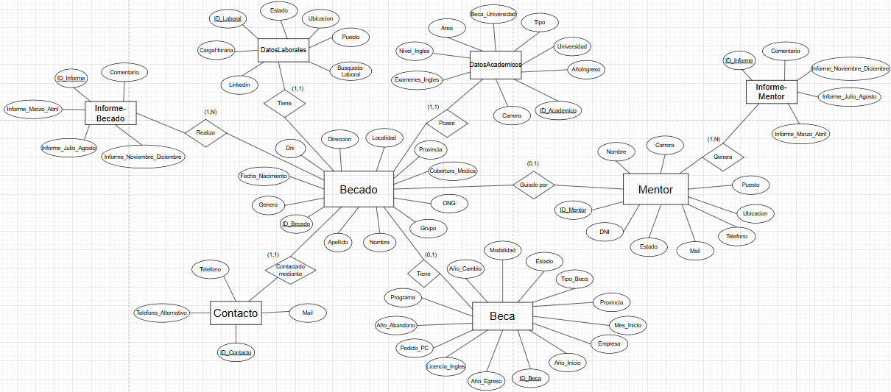
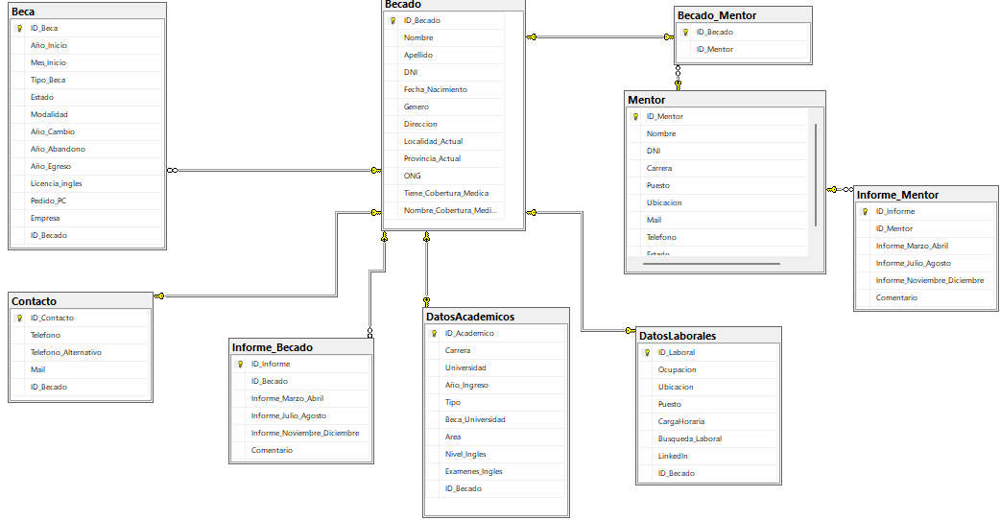

## 🧩 Diseño Conceptual – DER

El **Diagrama Entidad-Relación (DER)** representa de manera clara la estructura del sistema, que contempla ocho áreas funcionales:

- Becados
- Contacto
- Datos Académicos
- Datos Laborales
- Becas
- Mentores
- Informes de Becados
- Informes de Mentores

Este modelo garantiza la coherencia de la información, facilita el seguimiento y apoya la toma de decisiones.

---

## 🧱 Diseño Lógico – Modelo Relacional

El modelo lógico traduce el DER a tablas y relaciones normalizadas, cumpliendo con la **3FN (Tercera Forma Normal)** para evitar redundancias. Se usan claves primarias, foráneas, restricciones `CHECK` y campos `UNIQUE` para asegurar integridad y trazabilidad.

